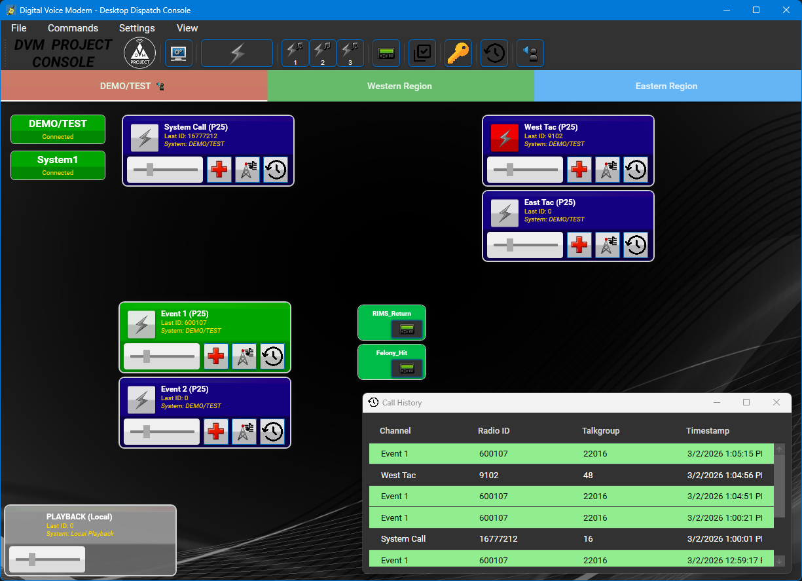

# Digital Voice Modem Desktop Dispatch Console

The Digital Voice Modem Desktop Dispatch Console ("DDC") is a WPF desktop application that operates similarly to a traditional dispatch console, allowing DVM users to monitor multiple talkgroups on a DVM FNE from a single application.

## Building

This project utilizes a standard Visual Studio solution for its build system.

The DDC software requires the library dependencies listed below. Generally, the software attempts to be as portable as possible and as library-free as possible. A basic Visual Studio install, with .NET is usually all that is needed to compile.

### Dependencies

- dvmvocoder (libvocoder); https://github.com/DVMProject/dvmvocoder

### Build Instructions

1. Clone the repository. `git clone --recurse-submodules https://github.com/DVMProject/dvmconsole.git`
2. Switch into the "dvmconsole" folder.
3. Open the "dvmconsole.sln" with Visual Studio.
4. Select "x86" as the CPU type.
5. Compile.

Please note that while x64 CPU types are supported, the dvmvocoder library must be compiled separately for that architecture.

## dvmconsole Configuration

1. **Create/Edit `codeplug.yml`**  
   An example codeplug is provided in the `configs` directory. Configure system parameters, network settings, and talkgroups as needed.  
   The file paths for both `keys.clear` and `alias.yml` must be defined within `codeplug.yml`.

2. **Configure Encryption Keys (`keys.clear`)**  
   If your system's talkgroups use encryption, define your key entries in the `keys.clear` file.  
   Each key entry should match the Key ID referenced in your codeplug.

3. **Configure RID Aliases (`alias.yml`)**  
   To display friendly names instead of raw RIDs, populate `alias.yml` with your Radio ID to alias mappings.  
   This allows the console to show readable identifiers for subscriber units.

4. Start `dvmconsole`.

5. Use **“Open Codeplug”** within the application to load your configuration.

## Project Notes

- The Desktop Dispatch Console does not support interfacing to base station or mobile radios. For a DVM-compatible console that supports base/mobile radio interfacing, see: https://github.com/W3AXL/RadioConsole2 and  https://github.com/W3AXL/rc2-dvm.

## License

This project is licensed under the AGPLv3 License – see the [LICENSE](LICENSE) file for details.

This software is intended for amateur and/or educational use. Any other use is at the user's discretion and risk. Commercial use is strongly discouraged.
