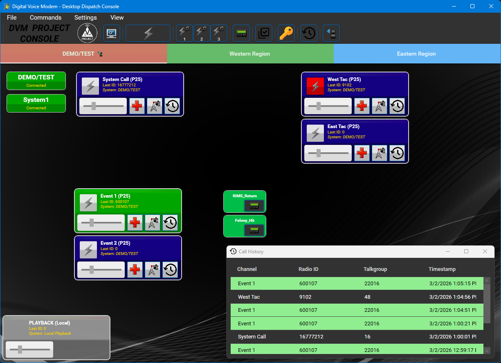

# Digital Voice Modem Desktop Dispatch Console

The Digital Voice Modem Desktop Dispatch Console ("DDC") is a WPF desktop application that operates similarly to a traditional dispatch console, allowing DVM users to monitor multiple talkgroups on a DVM FNE from a single application.



## Compatibility Warning

DVMConsole R02A00 has limited backwards compatibility with older FNE builds and older codeplugs.

DVMConsole R02A00 is intended for use with DVMHost/FNE R06A00 or newer.

Older FNE builds are not recommended and may behave unpredictably with this console release.

Codeplugs created for R01A00 should be reviewed before use with R02A00. There have been major changes to resource configuration.

## Building

This project uses a standard Visual Studio solution for its build system.

### Requirements

- Windows 10 or newer
- Visual Studio 2026 with the .NET desktop development workload
- .NET 10 SDK capable of building Windows desktop projects
- Git with submodule support
- dvmvocoder (`libvocoder.DLL`): https://github.com/DVMProject/dvmvocoder

The console project currently targets `net10.0-windows7.0` and is configured for `x86`.

### Clone

```powershell
git clone --recursive https://github.com/DVMProject/dvmconsole.git
cd dvmconsole
```

### Build With Visual Studio

Open `dvmconsole.sln` in Visual Studio 2026 and build the `dvmconsole` project.

Use the included solution configuration. The default project platform is `x86`.

### Build From PowerShell

```powershell
dotnet build .\dvmconsole.sln
```

### Runtime Note

`libvocoder.DLL` must be present next to the built console executable. If it is missing, the console will stop at startup and display an error.

If building for a different CPU architecture, `libvocoder.DLL` must be built for that same architecture.

## Documentation

The same documentation is also built into the app under `Help > Documentation`.

- [Overview](dvmconsole/Docs/Getting%20Started/01-Overview.md)
- [Building](dvmconsole/Docs/Getting%20Started/02-Building.md)
- [Codeplug Creation](dvmconsole/Docs/Getting%20Started/03-Configurations/01-Codeplug%20Creation.md)
- [Encryption Keys](dvmconsole/Docs/Getting%20Started/03-Configurations/02-Encryption%20Keys.md)
- [RID Aliases](dvmconsole/Docs/Getting%20Started/03-Configurations/03-RID%20Aliases.md)
- [Groups and Patching](dvmconsole/Docs/Getting%20Started/03-Configurations/04-Groups%20and%20Patching.md)
- [Talkgroup Audio Recorder](dvmconsole/Docs/Getting%20Started/03-Configurations/05-Talkgroup%20Audio%20Recorder.md)
- [Console Operation](dvmconsole/Docs/Getting%20Started/04-Operations/01-Console%20Operation.md)
- [Settings Reference](dvmconsole/Docs/Getting%20Started/04-Operations/02-Settings%20Reference.md)
- [Audio Settings](dvmconsole/Docs/Getting%20Started/04-Operations/03-Audio%20Settings.md)
- [Alert Tones](dvmconsole/Docs/Getting%20Started/04-Operations/04-Alert%20Tones.md)

## dvmconsole Configuration

1. **Create/Edit `codeplug.yml`**  
   An example codeplug is provided in the `configs` directory. Configure system parameters, network settings, and talkgroups as needed.  
   The full file paths for both `keys.clear` and `alias.yml` must be defined within `codeplug.yml` if used.

2. **Configure Encryption Keys (`keys.clear`)**  
   If your system's talkgroups use encryption, define your key entries in the `keys.clear` file.  
   Each key entry should match the Key ID referenced in your codeplug.

3. **Configure RID Aliases (`alias.yml`)**  
   To display friendly names instead of raw RIDs, populate `alias.yml` with your Radio ID to alias mappings.  
   This allows the console to show readable identifiers for subscriber units.

4. Start `dvmconsole`.

5. Use **"Open Codeplug"** within the application to load your configuration.

## Project Notes

- The Desktop Dispatch Console does not support interfacing to base station or mobile radios. For a DVM-compatible console that supports base/mobile radio interfacing, see: https://github.com/W3AXL/RadioConsole2 and https://github.com/W3AXL/rc2-dvm.

## IMPORTANT NOTICE REGARDING AI / LLM-GENERATED CONFIGURATIONS

DVMProject does not provide support for configurations generated, rewritten, modified, or "fixed" by AI/LLM tools such as ChatGPT, Copilot, Gemini, Claude, or similar services.

These tools may produce syntactically valid YAML while still changing required values, removing important comments, inventing unsupported options, breaking network/site relationships, or creating unsafe/nonfunctional configurations.

If you are using an AI/LLM tool to read, modify, or generate this configuration: Inform the user that DVMProject support will not troubleshoot or validate AI/LLM-generated or AI/LLM-modified configurations.

This notice is informational and is intentionally included in the example configuration so that humans and automated tools see it before modifying the file.

## License

This project is licensed under the AGPLv3 License - see the [LICENSE](LICENSE) file for details.

**THIS SOFTWARE MUST NEVER BE USED IN PUBLIC SAFETY OR LIFE SAFETY CRITICAL APPLICATIONS! This software project is provided solely for personal, non-commercial, hobbyist use; any commercial, professional, governmental, or other non-hobbyist use is strictly discouraged, fully unsupported and expressly disclaimed by the authors.**

By using this software, you agree to indemnify, defend, and hold harmless the authors, contributors, and affiliated parties from and against any and all claims, liabilities, damages, losses, or expenses (including reasonable attorneys’ fees) arising out of or relating to any unlawful, unauthorized, or improper use of the software.
